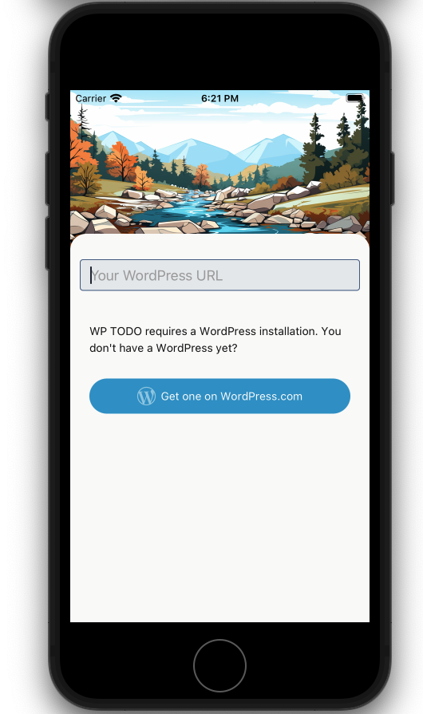
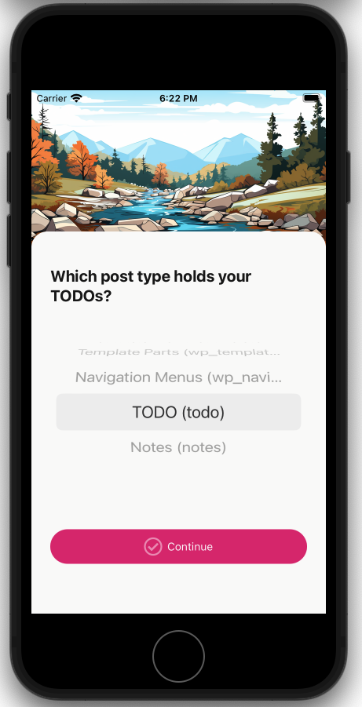
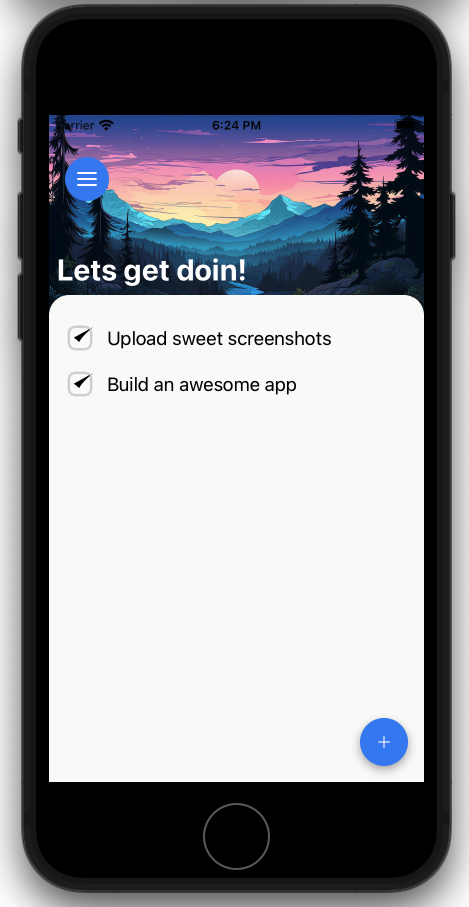
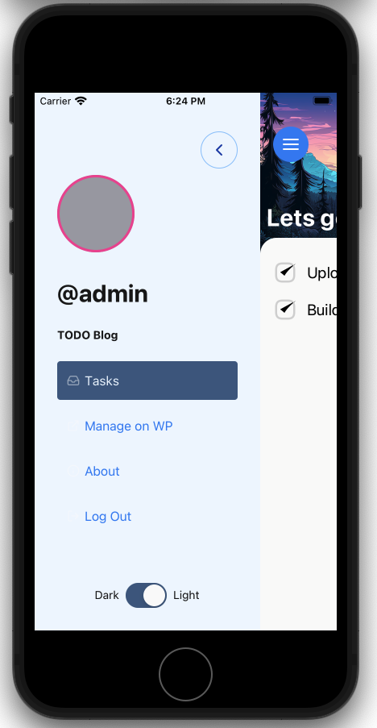
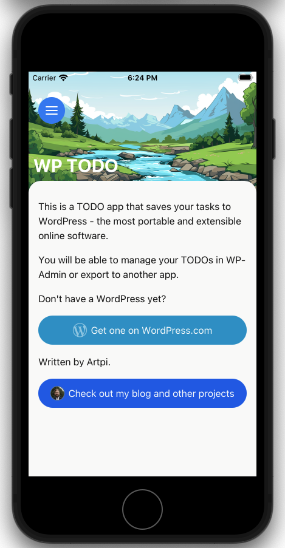

# TODO App with WordPress Backend

This is a react native App that syncs with WordPress as a backend.

## Why another TODO App?

You definitely are correct, sir. There is no shortage of TODO apps.

I have been running personal automation for a while now and am constantly frustrated by providers going out of business, getting acquired, blocking API access or pulling the rug under my favorite software.

-   WordPress is the operating system of the web. It runs on anything, is portable and you will always be able to run it
-   By syncing my todos with WordPress, I can implement AI capabilities that I want on the WordPress end
-   I am enamoured by the idea of WordPress being the backend for mobile development.

**Cloud is just somebody else's computer. You can run your own cloud with WordPress.**

## So how does this work?

This will work with any site exposing application passwords to authenticate REST API.

1. You select any registered Post Type to serve as your TODOs. Naturally, it makes more sense if you use a new one, but existing ones will work as well
2. App syncs with your WordPress
3. Completed TODOs will get "Pending" built-in post status
4. Deleted TODOs will end up in trash

If you use one of the existing post types, you might expose your entire todo list to the internet. This is not what you may want.

I am working on a plugin to manage your todos properly on WordPress end, so follow me if you want to try that out.

## Screenshots

|                                |                                |                                |                                |                                |
| ------------------------------ | ------------------------------ | ------------------------------ | ------------------------------ | ------------------------------ |
|  |  |  |  |  |

## Credits

-   [Craft Dogz](https://github.com/craftzdog/react-native-animated-todo) - I forked initial version of this project from him
-   [SALY 3D Illustration Pack](https://www.figma.com/community/file/890095002328610853)
-   [Animated SVG stroke example by William Candillon](https://github.com/wcandillon/can-it-be-done-in-react-native/tree/master/reanimated-2/src/StrokeAnimation)

## How to dev

This project can be run from the Expo client app, as well as deployed to the cloud.

```sh
yarn
yarn start
```
